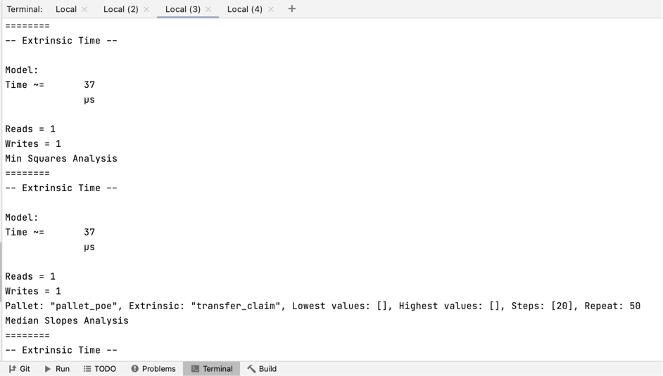

### Benchmarking setup for pallet-poe
* Need Build with: `cargo build --release --features runtime-benchmarks`
* Need Test with: `cargo test -p pallet-poe --features runtime-benchmarks`
* Need Make weights.rs with: `./target/release/node-template benchmark --chain dev --execution=wasm --wasm-execution=compiled --pallet pallet-poe --extrinsic '*' --steps 20 --repeat 50 --template=.maintain/frame-weight-template.hbs --output=./pallets/poe/src/weights.rs`

### ScreenShort
